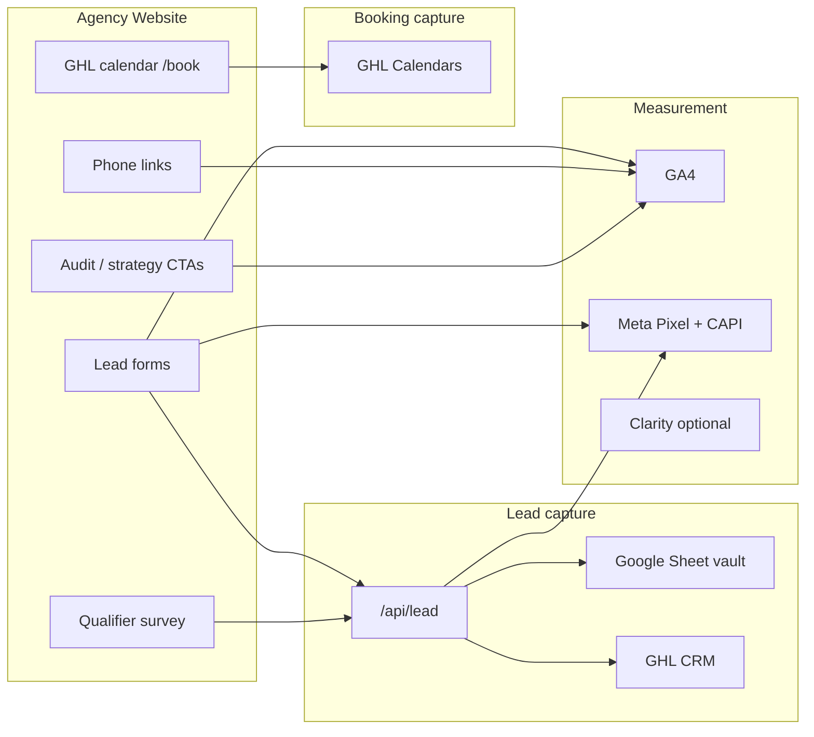

# Agency SOP — B2B Lead & Booking Tracking (Performance Marketing Agency)

**Use this for any B2B agency site running paid ads and optimizing for leads or booked calls.**

This SOP instruments **the agency's own website** — a performance marketing firm that runs Meta and Google ads for other businesses. There are no physical products, no inventory, no retail locations, and no dealer-specific pages.

**Two outcomes only:**
1. **Lead form / survey submission** — contact, audit request, strategy call request
2. **Calendar booking** — strategy call, discovery call, demo

**Two uses:**
1. **Master Cursor prompt** — Section 1 (paste into AI when building or auditing the agency site).
2. **Human SOP** — Sections 2–14 (setup, QA, troubleshooting).

**Starter kit:** `agency-starter/` in this repo (copy into any new HTML site folder).

---

## SECTION 1 — MASTER CURSOR PROMPT (generic B2B agency — fill CLIENT CONFIG)

```
You are building or auditing a B2B performance marketing agency website with a standardized lead + booking tracking stack.

## CLIENT CONFIG (fill before any work)

CLIENT_NAME:           [e.g. Start Scale Automate]
PRIMARY_DOMAIN:        [e.g. https://www.startscaleautomate.com]
INDUSTRY:              B2B performance marketing agency
STACK:                 static HTML + Cloudflare Pages Functions

GHL_LOCATION_ID:       [agency sub-account location ID]
GHL_API_TOKEN:         [pit-... Private Integration — server only, never in git]

GA4_MEASUREMENT_ID:    [G-XXXXXXXX]
CLARITY_PROJECT_ID:    [optional]
META_PIXEL_ID:         [required if running Meta ads for agency]
META_CAPI_TOKEN:       [optional EAA... — pairs with Pixel]
LEAD_VALUE_USD:        [e.g. 500 — Meta Lead value for optimization; not a product price]

GOOGLE_SHEET_ID:       [Lead Vault spreadsheet]
GOOGLE_SA_EMAIL:       [service account]
GOOGLE_SA_PRIVATE_KEY: [Cloudflare secret]

DEPLOY_TARGET:         [Cloudflare Pages project name]

## ENABLED MODULES (B2B agency site)

[ ] CORE — native forms, /api/lead, Sheet vault, GHL upsert
[ ] META — Pixel + CAPI with event_id deduplication
[ ] UTM — capture utm_source, utm_medium, utm_campaign from URL → sessionStorage → every form POST → GHL custom fields
[ ] TURNSTILE — bot protection on forms
[ ] ALERTS — email when GHL sync fails
[ ] LOOKER — GA4 + GHL Sheet blend (no GBP for pure B2B agency)
[ ] QUALIFIER_SURVEY — multi-step B2B qualifier after opt-in (POST to /api/lead)
[ ] GHL_CALENDAR_EMBED — /book or /schedule strategy/discovery call iframe
[ ] CHAT_WIDGET — GHL Live Chat (separate from form pipeline)

## ARCHITECTURE (same for every B2B agency build)

Browser native form or qualifier survey
  → capture UTM params from URL on page load (sessionStorage)
  → POST /api/lead (JSON) with utm_source, utm_medium, utm_campaign
  → validate (honeypot, email, phone, source-specific rules)
  → Google Sheet "All Leads" FIRST (required — forms fail without Sheet)
  → GHL Contacts API upsert (if token set)
  → Meta CAPI Lead (if token set — does not block response)
  → Browser: GA4 generate_lead + fbq Lead (same event_id as CAPI)

Calendar booking (separate path):
  GHL calendar embed on /book or /schedule
  → tracked in GHL Calendars, NOT /api/lead (unless workflow webhook added)

## CORE FILES (copy from agency-starter/)

functions/api/lead.js          — API entry
functions/lib/validate.js      — validation + source rules
functions/lib/ghl.js           — tags + custom fields mapping
functions/lib/sheets.js        — Lead Vault
functions/lib/meta-capi.js   — server Meta events
functions/lib/cors.js          — CORS / origin lock
functions/lib/alert.js         — failure alerts

js/lead-form.js                — bind forms, UTM attach, POST, browser tracking
js/native-form.js              — render form HTML into [data-native-form]
js/call-tracking.js            — tel: link → GA4 click_call, Meta Contact
js/pricing-tracking.js         — CTA clicks → GA4 pricing_click (audit / strategy CTAs)

## LEAD SOURCE CATALOG (B2B agency — define in ghl.js)

Every form has data-lead-source="[code]". Server maps code → GHL tags + custom fields.

| Page / Form                    | source code       | GHL tags (example)                    |
|--------------------------------|-------------------|---------------------------------------|
| Homepage hero form             | lp-hero           | lp-lead, website-form                 |
| Contact page                   | contact-page      | contact-page, website-form            |
| Free audit / free offer form   | audit-request     | audit-request, website-form           |
| Strategy call form             | strategy-call     | strategy-call, website-form           |
| Survey / qualifier             | qualifier-survey  | qualifier-survey, website-form      |
| Calendar booking (if form)     | book-call         | book-call, website-form               |

Base tags on every API lead: website-form, lead-api

RULE: Tags must match GHL workflows the agency actually uses. Document in LEAD-SOURCES.md.

## GHL CUSTOM FIELDS (create in GHL first, then map in ghl.js)

Standard B2B agency fields:
- lead_source_page (URL)
- contact_message
- business_type (what kind of business they run)
- monthly_revenue_range (qualifier — if survey module enabled)
- ad_spend_range (qualifier — if survey module enabled)
- primary_goal (leads / appointments / scale — if survey module enabled)
- utm_source, utm_medium, utm_campaign (from URL params — always attach when present)

## UTM TRACKING (required for paid ads attribution)

1. On page load: read utm_source, utm_medium, utm_campaign from URL query string
2. Store in sessionStorage (persists across same-session navigation)
3. lead-form.js attaches UTM fields to every POST /api/lead body
4. ghl.js maps to GHL custom fields utm_source, utm_medium, utm_campaign
5. Sheet "All Leads" tab includes UTM columns for reporting

This is how you know which ad, campaign, or channel generated each lead.

## META DEDUPLICATION (required when Pixel + CAPI both enabled)

1. lead-form.js generates UUID before submit → meta_event_id
2. POST body includes meta_event_id, fbp, fbc
3. meta-capi.js sends Lead with event_id = same UUID
4. Browser: fbq('track','Lead', {...}, { eventID: uuid })
5. Meta dedupes → 1 conversion

NEVER fire Lead on thank-you page AND on form success (double count). Pick one:
- RECOMMENDED: fire only on form success in lead-form.js; thank-you page = no conversion tags

## GA4 CONVERSIONS (mark in Admin)

Minimum:
- click_call — phone taps
- pricing_click — audit / strategy / "book a call" CTA clicks (event name stays pricing_click)
- generate_lead — successful form API response

Optional (qualifier survey module):
- post_optin_step_1, post_optin_step_2, etc. — survey step completion in GA4 only
- Final survey submit still fires generate_lead once via /api/lead

## CLOUDFLARE SECRETS (Production)

Required:
- GOOGLE_SHEETS_ID, GOOGLE_SERVICE_ACCOUNT_EMAIL, GOOGLE_SERVICE_ACCOUNT_PRIVATE_KEY

Recommended:
- GHL_API_TOKEN, GHL_LOCATION_ID
- META_CAPI_ACCESS_TOKEN, META_PIXEL_ID
- ALLOWED_ORIGIN=https://agency-domain.com

Optional:
- TURNSTILE_SECRET_KEY, ALERT_EMAIL, RESEND_API_KEY

## WHAT NOT TO ASSUME

- No inventory gates, product cards, or dealer pages on agency sites
- GHL calendar bookings do NOT flow through /api/lead unless you add a webhook workflow
- Qualifier surveys saving to localStorage only do NOT reach GHL — must POST to /api/lead
- Meta instant forms (Lead Ads) sync separately via GHL Meta integration (metalead tag)
- Chat is a separate GHL pipeline from form leads

When implementing: enable only the modules checked above. Optimize reporting for leads + booked calls only.
```

---

## SECTION 2 — THE B2B AGENCY STACK



**Three questions every agency build must answer:**

| Question | Answer lives in |
|----------|-----------------|
| Did they try to contact us? | GA4 `click_call`, `pricing_click` |
| Did they submit a form or qualifier? | Sheet + GHL (truth), GA4 `generate_lead` (funnel) |
| Did they book a call? | GHL Calendars (truth), optional workflow tags |
| Did Meta get credit? | Events Manager (deduped Lead) + UTM fields on contact |

---

## SECTION 3 — MODULES (B2B agency)

### Module A — CORE (always)

| Piece | Purpose |
|-------|---------|
| `native-form.js` + `lead-form.js` | Forms without GHL iframe embeds |
| `POST /api/lead` | Single lead endpoint |
| Google Sheet "All Leads" | Backup + audit trail + UTM columns |
| GHL upsert | CRM contacts + tags |
| `call-tracking.js` | Phone click events |

**Typical agency forms:** homepage hero, contact, free audit request, strategy call request.

---

### Module B — META ADS (if agency runs Facebook/Instagram for itself)

| Piece | Purpose |
|-------|---------|
| Pixel in `<head>` | PageView, Contact, Lead |
| `meta-capi.js` | Server Lead when Sheet saves |
| `event_id` dedup | One conversion per submit |
| UTM custom fields | Attribute lead to campaign in GHL |

Skip Pixel/CAPI if agency is Google Ads / SEO only for own site.

---

### Module C — CTA TRACKING (recommended)

`pricing-tracking.js` fires `pricing_click` on:
- "Get a free audit" buttons
- "Book a strategy call" CTAs
- Service / case study CTAs
- Any `[data-track-pricing]` element

**Event name stays `pricing_click`** for cross-client Looker templates. Button labels change per page.

---

### Module D — UTM ATTRIBUTION (required for paid ads)

All paid traffic should carry UTM parameters. The site must capture and persist them.

**On page load (lead-form.js or dedicated utm.js):**

```js
// Read from URL, write to sessionStorage
var params = new URLSearchParams(window.location.search);
['utm_source', 'utm_medium', 'utm_campaign'].forEach(function (key) {
  var val = params.get(key);
  if (val) sessionStorage.setItem(key, val);
});
```

**On every form POST:**

```json
{
  "source": "audit-request",
  "full_name": "...",
  "utm_source": "facebook",
  "utm_medium": "paid",
  "utm_campaign": "audit-lp-q2"
}
```

**In GHL:** map to custom fields `utm_source`, `utm_medium`, `utm_campaign`.

**In Google Sheet:** add columns `utm_source | utm_medium | utm_campaign` to row 1.

**Standard UTM conventions for agency ads:**

| Channel | utm_source | utm_medium | utm_campaign example |
|---------|------------|----------|------------------------|
| Meta lead gen | facebook | paid | audit-lp-2026 |
| Meta retargeting | facebook | retargeting | site-visitors-30d |
| Google Search | google | cpc | brand-search |
| Google Display | google | display | awareness-q2 |
| LinkedIn | linkedin | paid | b2b-owners |

---

### Module E — B2B QUALIFIER SURVEY (optional, recommended)

Multi-step survey after someone opts in (thank-you redirect, dedicated `/qualify` page, or post-audit form).

**Survey steps:**

| Step | Question | Field key |
|------|----------|-----------|
| 1 | What type of business do you run? | `business_type` |
| 2 | What is your monthly revenue range? | `monthly_revenue_range` |
| 3 | Are you currently running paid ads? | `ad_spend_range` (or yes/no + range follow-up) |
| 4 | What is your primary goal? | `primary_goal` |

**Goal options:** More leads / More booked calls / Scale existing campaigns

**On completion:** POST to `/api/lead` with:
- `source`: `qualifier-survey`
- All survey answers as custom fields
- UTM params from sessionStorage
- Same `meta_event_id` dedup as standard forms

**Warning:** Surveys that only save to `localStorage` never reach GHL. Always wire final step to `/api/lead`.

**GA4 (optional):** fire `post_optin_step_N` on each step for funnel drop-off analysis. Fire `generate_lead` once on final API success only.

---

### Module F — GHL CALENDAR EMBED (recommended)

| Item | Value |
|------|-------|
| Route | `/book` or `/schedule` |
| Embed | GHL calendar for strategy call / discovery call / demo |
| Form on page? | Usually no — calendar only |

Bookings are tracked in **GHL Calendars**, not `/api/lead`, unless you:
- Add GHL workflow → tag on appointment booked (e.g. `booked-strategy-call`), or
- Use GHL inbound webhook → your API

Document calendar bookings as a **separate conversion path** in agency reporting:

| Metric | Source |
|--------|--------|
| Form leads | Sheet + GHL (`website-form` tag) |
| Qualified leads | GHL (`qualifier-survey` tag) |
| Booked calls | GHL Calendars + optional `booked-*` tag |

**CTA flow pattern:** Ad → landing page form (`audit-request`) → thank-you → `/qualify` survey → `/book` calendar.

---

### Module G — LIVE CHAT (optional)

GHL chat widget = **Conversations**, not `website-form` tags.

Report chat leads separately in GHL. Do not merge with form lead counts unless workflows add tags.

---

### Module H — LOOKER DASHBOARD (optional)

Two-source template for B2B agency (no GBP):

| Source | Metric |
|--------|--------|
| GA4 | `click_call`, `pricing_click`, `generate_lead` |
| GHL Sheet sync | `form_leads` daily count, UTM breakdown |

Add a third row for calendar bookings if GHL appointment sync is configured.

---

## SECTION 4 — NEW CLIENT ONBOARDING CHECKLIST

### Phase 1 — Discovery (before code)

- [ ] List every form on the site (page, fields, success behavior)
- [ ] Define **lead source codes** table (Section 1) — one code per form/campaign
- [ ] Define **GHL tags** per source — must match workflows agency will build
- [ ] List GHL custom fields to create (names must match `ghl.js` keys)
- [ ] Confirm: Meta ads? Google ads? Qualifier survey? Calendar embed? Chat?
- [ ] Set `LEAD_VALUE_USD` for Meta optimization (not a product price)
- [ ] Define UTM naming convention per active campaign

### Phase 2 — GHL setup

- [ ] Sub-account location ID documented
- [ ] Private Integration token (`pit-...`) with contacts write scope
- [ ] Custom fields created: `lead_source_page`, `contact_message`, `business_type`, `monthly_revenue_range`, `ad_spend_range`, `primary_goal`, `utm_source`, `utm_medium`, `utm_campaign`
- [ ] Workflows drafted: trigger on tag added (per source code)
- [ ] Calendar embed URL copied for `/book` or `/schedule`
- [ ] Optional: workflow on appointment booked → tag `booked-strategy-call`
- [ ] If chat: widget ID configured

### Phase 3 — Google Sheet Lead Vault

- [ ] New Sheet per agency site (do not share across clients)
- [ ] Tab **All Leads** — row 1 headers:
  `submission_id | submitted_at | source | full_name | email | phone | message | business_type | monthly_revenue_range | ad_spend_range | primary_goal | utm_source | utm_medium | utm_campaign | page_url | ghl_status | ghl_contact_id | ghl_error`
- [ ] Tab **Missed Leads** (GHL failures)
- [ ] Service account shared to Sheet (Editor)
- [ ] Cloudflare env vars set

### Phase 4 — Analytics

- [ ] New GA4 property → measurement ID in all pages
- [ ] Clarity project (optional)
- [ ] Meta Pixel (if running Meta for agency)
- [ ] Mark conversions: `click_call`, `pricing_click`, `generate_lead`
- [ ] UTM capture script live on all landing pages
- [ ] **Do not** double-fire on thank-you page if `lead-form.js` already fires

### Phase 5 — Deploy & QA

- [ ] `POST /api/lead` returns 200 on test submit
- [ ] Sheet row appears with correct `source` and UTM columns
- [ ] GHL contact with correct tags + custom fields
- [ ] Meta Test Events: Browser + Server Lead, same Event ID (if Meta enabled)
- [ ] Phone tap → `click_call` in GA4 Realtime
- [ ] Audit/strategy CTA → `pricing_click`
- [ ] Qualifier survey completion → GHL contact updated with qualifier fields
- [ ] Test URL with `?utm_source=test&utm_medium=qa&utm_campaign=sop` → UTM on contact

### Phase 6 — Reporting

- [ ] Looker report cloned from template, agency name + logo
- [ ] GHL → Sheet hourly sync installed (if using dashboard)
- [ ] Agency team told: **form leads = GHL/Sheet**, **bookings = GHL Calendars**, funnel = GA4, ads = Meta + UTM fields

---

## SECTION 5 — LEAD SOURCE DESIGN PATTERN

Use a **consistent naming scheme** for B2B agency sites:

```
{page-or-offer}-{action}

Examples:
lp-hero
contact-page
audit-request
strategy-call
qualifier-survey
book-call
```

**In `ghl.js`, each source maps to:**

1. Base tags: `website-form`, `lead-api` (always)
2. Campaign tag: e.g. `audit-request`, `strategy-call`, `qualifier-survey`
3. Custom fields: only what that form collects + UTM fields when present

**B2B agency `tagsForSource()` example:**

```js
function tagsForSource(source) {
  var tags = ['website-form', 'lead-api'];
  if (source === 'lp-hero') tags.push('lp-lead');
  if (source === 'contact-page') tags.push('contact-page');
  if (source === 'audit-request') tags.push('audit-request');
  if (source === 'strategy-call') tags.push('strategy-call');
  if (source === 'qualifier-survey') tags.push('qualifier-survey');
  if (source === 'book-call') tags.push('book-call');
  return tags;
}
```

---

## SECTION 6 — META PIXEL + CAPI (universal rules)

### When to use

| Agency runs Meta ads for own site? | Pixel | CAPI |
|------------------------------------|-------|------|
| Yes | Required | Strongly recommended |
| No | Skip | Skip |

### Dedup contract (non-negotiable)

```
event_id = UUID generated at submit time
Browser Pixel Lead.eventID = event_id
Server CAPI Lead.event_id = event_id
```

### What to send server-side

- Hashed email (`em`)
- Hashed phone (`ph`)
- IP, user agent
- `fbp`, `fbc` cookies from browser POST body
- `value` + `currency` from CLIENT CONFIG (`LEAD_VALUE_USD`)

### Common mistake

Firing Lead on **thank-you page load** after already firing on form success → inflates ROAS.  
**Fix:** Thank-you page = confirmation only, no `generate_lead` / `fbq Lead`.

---

## SECTION 7 — GA4 EVENT CATALOG (B2B agency)

| Event | Fires when | Agency site |
|-------|------------|-------------|
| `click_call` | `tel:` link tap | Yes |
| `pricing_click` | Audit / strategy / book CTA click | Yes |
| `generate_lead` | Form or qualifier API success | Yes |
| `post_optin_step_N` | Qualifier survey step (optional) | Optional |

**Looker KPI row (B2B agency):**

1. Form leads (GHL Sheet — filter `website-form`)
2. Qualified leads (GHL Sheet — filter `qualifier-survey`)
3. Call button taps (GA4 `click_call`)
4. CTA clicks (GA4 `pricing_click`)
5. Form conversions (GA4 `generate_lead`)
6. Booked calls (GHL Calendars — separate sync)

---

## SECTION 8 — WHAT FLOWS TO GHL vs WHAT DOESN'T

| Action | Reaches GHL via /api/lead? | How to track |
|--------|---------------------------|--------------|
| Native form submit | **Yes** | Tags + Sheet + UTM fields |
| Qualifier survey complete | **Yes** (if wired to API) | `qualifier-survey` tag + custom fields |
| Phone tap on site | No | GA4 only |
| GHL calendar book | No (default) | GHL appointments + optional workflow tag |
| Live chat message | No | GHL conversations |
| Meta Lead Ad instant form | No | GHL Meta integration (`metalead` tag) |
| Qualifier survey (localStorage only) | **No** | Wire final step to `/api/lead` |

**Rule:** Agency reporting has **two primary pipelines** — form/survey leads and calendar bookings. Do not merge into one number without documenting the split.

---

## SECTION 9 — CLOUDFLARE SECRETS TEMPLATE

```bash
# Required — forms return 503 without these
GOOGLE_SHEETS_ID=
GOOGLE_SERVICE_ACCOUNT_EMAIL=
GOOGLE_SERVICE_ACCOUNT_PRIVATE_KEY=

# Recommended — CRM sync
GHL_API_TOKEN=
GHL_LOCATION_ID=

# Optional — Meta (agency running own Meta ads)
META_CAPI_ACCESS_TOKEN=
META_PIXEL_ID=

# Optional — security & alerts
ALLOWED_ORIGIN=https://www.AGENCY_DOMAIN.com
TURNSTILE_SECRET_KEY=
ALERT_EMAIL=
RESEND_API_KEY=
CLIENT_NAME=Agency Name
```

---

## SECTION 10 — QA CHECKLIST (B2B agency)

### Smoke test (15 min)

- [ ] Submit each live form with test email
- [ ] Sheet row: correct `source`, `page_url`, UTM columns, `ghl_status=SENT`
- [ ] GHL: contact exists, tags match source table, UTM custom fields populated
- [ ] GA4 Realtime: `generate_lead` once per submit (not twice)
- [ ] Meta (if enabled): one deduped Lead per submit
- [ ] Phone tap: `click_call`
- [ ] Audit/strategy CTA: `pricing_click`
- [ ] Qualifier survey: all 4 answers land in GHL custom fields
- [ ] Visit with UTM params → submit form → UTM on GHL contact

### Failure drills

- [ ] Break GHL token → form still saves Sheet, Missed Leads row, visitor sees success
- [ ] Break Sheet creds → form returns error (by design — Sheet is required)

---

## SECTION 11 — TROUBLESHOOTING (B2B agency)

| Symptom | Cause | Fix |
|---------|-------|-----|
| Form 503 | Sheet secrets missing | Cloudflare env vars |
| No GHL contact | Token missing/scope | pit- token + location ID |
| Wrong tag | Wrong `data-lead-source` | Fix form attribute |
| Missing UTM on contact | Not captured or session cleared | Verify sessionStorage + POST body |
| Double GA4 leads | thank-you + lead-form both fire | Remove thank-you tracking |
| Double Meta leads | Same + no eventID on thank-you | Fire Lead once with event_id only |
| Looker ≠ GHL count | Hourly sync lag | Use Sheet "All Leads" for real-time |
| Calendar books missing | Separate pipeline | GHL calendar reports |
| Survey data missing | localStorage only | POST final step to `/api/lead` |
| Can't attribute lead to ad | No UTM on landing URL | Add UTMs to all ad destination URLs |

---

## SECTION 12 — UTM TRACKING (detailed)

### Why it matters

GA4 and Meta tell you aggregate campaign performance. **UTM fields on each GHL contact** tell you which specific lead came from which ad — critical for B2B agencies proving ROI to themselves and auditing their own funnel.

### Implementation checklist

- [ ] `lead-form.js` reads UTM params on DOMContentLoaded
- [ ] Values stored in `sessionStorage` (not localStorage — session-scoped is correct for attribution window)
- [ ] Every `POST /api/lead` includes `utm_source`, `utm_medium`, `utm_campaign` (empty string if absent)
- [ ] `validate.js` accepts optional UTM fields (no strict validation required)
- [ ] `ghl.js` maps to GHL custom fields
- [ ] `sheets.js` writes UTM columns
- [ ] All Meta/Google ad destination URLs include UTMs

### Ad URL template

```
https://www.youragency.com/audit?utm_source=facebook&utm_medium=paid&utm_campaign=free-audit-lp-june
```

### Reporting use

Filter GHL contacts or Sheet by `utm_campaign` to see leads per campaign. Compare to Meta spend for effective cost per qualified lead.

---

## SECTION 13 — QUICK COPY: CLIENT ONE-PAGER (give to account manager)

```
LEAD PIPELINE (B2B Agency Site)
Form or qualifier survey → Website API → Google Sheet (backup) → GoHighLevel CRM
Optional: Meta server conversion for ad tracking
UTM params on every lead show which campaign drove the submission

WE COUNT FORM LEADS FROM: GHL contacts (tag: website-form) + Sheet
WE COUNT QUALIFIED LEADS FROM: GHL contacts (tag: qualifier-survey)
WE COUNT BOOKED CALLS FROM: GHL Calendars (separate from form pipeline)
WE COUNT FUNNEL FROM: GA4 (calls, CTA clicks, form events)
WE COUNT ADS FROM: Meta Events Manager + UTM fields on contacts

TAGS = how we know which page or offer they came from.
Workflows in GHL trigger on tags — not on page URLs.

PRIMARY CONVERSIONS:
1. Audit request or strategy call form submit
2. Qualifier survey complete (if enabled)
3. Calendar booking on /book or /schedule

NOT COUNTED AS FORM LEADS:
- Phone calls (tracked in GA4, not CRM unless they also form)
- Chat messages
- Calendar bookings (unless workflow adds a tag)
- Meta instant forms (separate Meta → GHL sync)
```

---

## SECTION 14 — REPO STRUCTURE TO CLONE FOR NEW AGENCY SITE

```
/functions/api/lead.js
/functions/lib/{validate,ghl,sheets,meta-capi,cors,alert}.js
/js/lead-form.js          ← includes UTM capture + attach
/js/native-form.js
/js/call-tracking.js
/js/pricing-tracking.js
/css/lead-form.css
/thank-you.html            ← no conversion tags (dedup safe)
/snippets/                  ← head-tracking, body-scripts, form-contact
/CLIENT.config.json
/LEAD-SOURCES.md           ← copy from LEAD-SOURCES.example.md
/dashboard/AGENCY_B2B_TRACKING_AND_LEADS_SOP.md   ← this file
/lead-api.env.example
/package.json
```

**Replace per agency site:** GA4 ID, Pixel ID, GHL location, source/tag table in `ghl.js`, form placements in HTML, branding, calendar embed URL.

**Do not add:** inventory gates, product cards, dealer pages, retail location logic.

**Copy starter kit:**

```bash
cp -R agency-starter/functions ./
cp -R agency-starter/js ./js/
cp -R agency-starter/css ./css/
cp agency-starter/thank-you.html ./
cp agency-starter/CLIENT.config.json ./
cp agency-starter/package.json ./
```

Then follow Sections 4–10 of this SOP.
