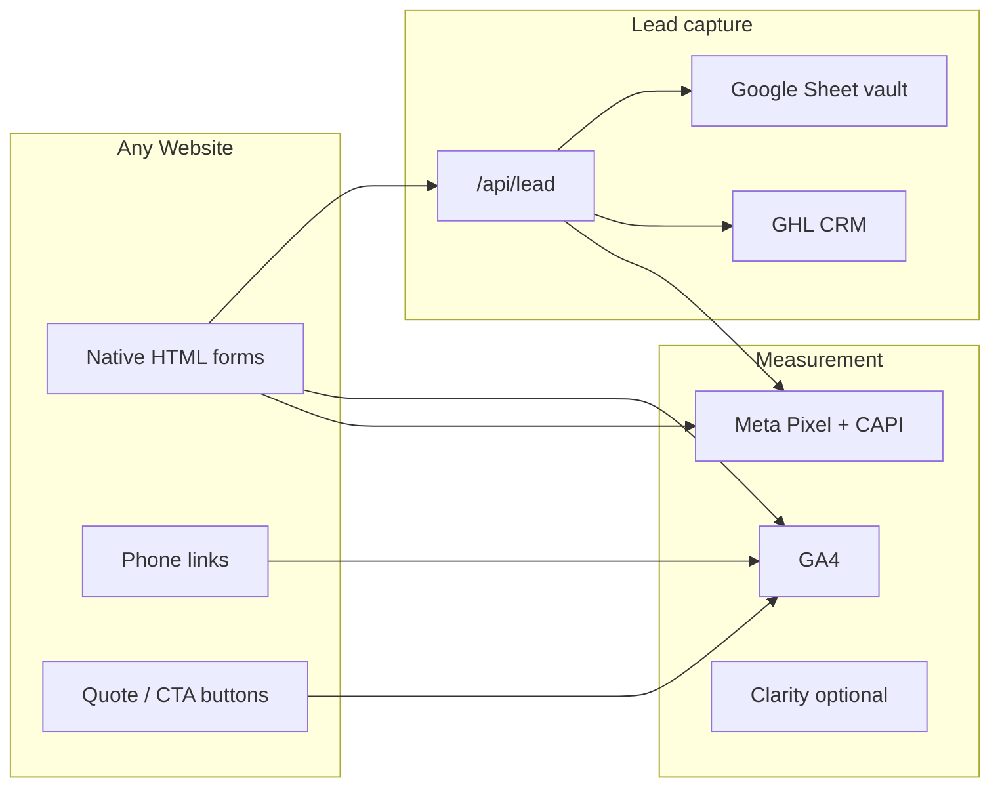

# Agency SOP — Website Tracking, Forms & GHL (Any Client)

> **B2B performance marketing agency (own site)?** Use the dedicated doc instead:  
> [`AGENCY_B2B_TRACKING_AND_LEADS_SOP.md`](./AGENCY_B2B_TRACKING_AND_LEADS_SOP.md)

**Use this for every client site** — dealer with inventory, local service business, agency funnel, or simple brochure site.  
Paradise Spas is one **implementation example**, not the template.

**Two uses:**
1. **Master Cursor prompt** — Section 1 (paste into AI when onboarding a new client build).
2. **Human SOP** — Sections 2–12 (setup, QA, troubleshooting).

---

## SECTION 1 — MASTER CURSOR PROMPT (generic — fill CLIENT CONFIG)

```
You are building or auditing a client website with a standardized lead + tracking stack.

## CLIENT CONFIG (fill before any work)

CLIENT_NAME:           [e.g. Acme HVAC]
PRIMARY_DOMAIN:        [e.g. https://www.acmehvac.com]
INDUSTRY:              [e.g. home services / dealer / agency funnel]
STACK:                 [static HTML + Cloudflare Pages Functions | Next.js | other]

GHL_LOCATION_ID:       [sub-account location ID]
GHL_API_TOKEN:         [pit-... Private Integration — server only, never in git]

GA4_MEASUREMENT_ID:    [G-XXXXXXXX]
CLARITY_PROJECT_ID:    [optional]
META_PIXEL_ID:         [optional — leave blank if no paid social]
META_CAPI_TOKEN:       [optional EAA... — pairs with Pixel]
LEAD_VALUE_USD:        [e.g. 500 — used for Meta Lead value]

GOOGLE_SHEET_ID:       [Lead Vault spreadsheet]
GOOGLE_SA_EMAIL:       [service account]
GOOGLE_SA_PRIVATE_KEY: [Cloudflare secret]

DEPLOY_TARGET:         [Cloudflare Pages project name]

## ENABLED MODULES (check what this client needs)

[ ] CORE — native forms, /api/lead, Sheet vault, GHL upsert
[ ] META — Pixel + CAPI with event_id deduplication
[ ] TURNSTILE — bot protection on forms
[ ] ALERTS — email when GHL sync fails
[ ] LOOKER — GA4 + optional GBP + GHL Sheet blend
[ ] INVENTORY_GATE — gated pricing page (dealers only)
[ ] POST_OPTIN_SURVEY — multi-step intent survey after opt-in (optional)
[ ] GHL_CALENDAR_EMBED — book-a-time iframe (no form on page)
[ ] CHAT_WIDGET — GHL Live Chat (separate from form pipeline)

## ARCHITECTURE (same for every client)

Browser native form
  → POST /api/lead (JSON)
  → validate (honeypot, email, phone, source-specific rules)
  → Google Sheet "All Leads" FIRST (required — forms fail without Sheet)
  → GHL Contacts API upsert (if token set)
  → Meta CAPI Lead (if token set — does not block response)
  → Browser: GA4 generate_lead + fbq Lead (same event_id as CAPI)

## CORE FILES (copy pattern, rename per project)

functions/api/lead.js          — API entry
functions/lib/validate.js      — validation + source rules
functions/lib/ghl.js             — tags + custom fields mapping
functions/lib/sheets.js          — Lead Vault
functions/lib/meta-capi.js       — server Meta events
functions/lib/cors.js            — CORS / origin lock
functions/lib/alert.js           — failure alerts

lead-form.js                     — bind forms, POST, browser tracking
native-form.js                   — render form HTML into [data-native-form]
call-tracking.js                 — tel: link → GA4 click_call, Meta Contact
pricing-tracking.js              — quote/CTA clicks → GA4 pricing_click (rename labels per site)

## LEAD SOURCE CATALOG (define per client — do not hardcode "inventory")

Every form has data-lead-source="[code]". Server maps code → GHL tags + custom fields.

Example minimal agency site:
| Page / form           | source code      | GHL tags (example)        |
|-----------------------|------------------|---------------------------|
| Contact page          | contact-page     | contact-page              |
| Service quote modal   | quote-modal      | quote-request             |
| Financing / apply     | financing-page   | financing-page            |
| Landing page hero     | lp-hero          | lp-lead                   |
| Book consult (if form)| book-consult     | book-consult              |

Example dealer add-ons (only if client has them):
| Inventory gate        | inventory-gate   | inventory-unlock          |
| Campaign gate         | campaign-gate    | campaign-unlock           |
| Fair / event reserve  | event-reserve    | event-reserve             |

RULE: Tags must match GHL workflows the client actually uses. Document in CLIENT_CONFIG.

## GHL CUSTOM FIELDS (create in GHL first, then map in ghl.js)

Standard fields to support across clients:
- lead_source_page (URL)
- contact_message
- financing_interest (yes/maybe/no) — if applicable
- product_interested_in, product_category — if product site
- campaign_attendance / visit_day — if event client
- [client-specific fields]

## META DEDUPLICATION (required when Pixel + CAPI both enabled)

1. lead-form.js generates UUID before submit → meta_event_id
2. POST body includes meta_event_id, fbp, fbc
3. meta-capi.js sends Lead with event_id = same UUID
4. Browser: fbq('track','Lead', {...}, { eventID: uuid })
5. Meta dedupes → 1 conversion

NEVER fire Lead on thank-you page AND on form success (double count). Pick one:
- RECOMMENDED: fire only on form success in lead-form.js; thank-you page = no conversion tags

## GA4 CONVERSIONS (mark in Admin for every client)

Minimum:
- click_call — phone taps
- pricing_click — quote / CTA / "get price" (rename per client; event name stays)
- generate_lead — successful form API response

Optional:
- inventory_unlock / campaign_unlock — only if gated module enabled
- post_optin_* — only if survey module enabled

## CLOUDFLARE SECRETS (Production)

Required:
- GOOGLE_SHEETS_ID, GOOGLE_SERVICE_ACCOUNT_EMAIL, GOOGLE_SERVICE_ACCOUNT_PRIVATE_KEY

Recommended:
- GHL_API_TOKEN, GHL_LOCATION_ID
- META_CAPI_ACCESS_TOKEN, META_PIXEL_ID
- ALLOWED_ORIGIN=https://client-domain.com

Optional:
- TURNSTILE_SECRET_KEY, ALERT_EMAIL, RESEND_API_KEY

## WHAT NOT TO ASSUME

- Not every site has /inventory or gated pricing
- Not every site has fair/event pages
- Not every site has Meta ads (skip Pixel/CAPI module)
- Not every site has chat (separate GHL channel if enabled)
- GHL calendar bookings do NOT flow through /api/lead unless you add a webhook
- Post-opt-in surveys in localStorage only do NOT reach GHL unless wired to API

When implementing: enable only the modules in CLIENT CONFIG. Do not copy dealer-only pages to agency sites.
```

---

## SECTION 2 — THE UNIVERSAL STACK (what every client gets)



**Three questions every build must answer:**

| Question | Answer lives in |
|----------|-----------------|
| Did they try to contact us? | GA4 `click_call`, `pricing_click` |
| Did they submit a form? | Sheet + GHL (truth), GA4 `generate_lead` (funnel) |
| Did Meta get credit? | Events Manager (deduped Lead) |

---

## SECTION 3 — MODULES (enable per client)

### Module A — CORE (always)

| Piece | Purpose |
|-------|---------|
| `native-form.js` + `lead-form.js` | Forms without GHL iframe embeds |
| `POST /api/lead` | Single lead endpoint |
| Google Sheet "All Leads" | Backup + audit trail |
| GHL upsert | CRM contacts + tags |
| `call-tracking.js` | Phone click events |

**Agency site typical forms:** contact, quote request, newsletter (if needed), landing page lead.

**No inventory required.**

---

### Module B — META ADS (if client runs Facebook/Instagram)

| Piece | Purpose |
|-------|---------|
| Pixel in `<head>` | PageView, Contact, Lead |
| `meta-capi.js` | Server Lead when Sheet saves |
| `event_id` dedup | One conversion per submit |

Skip entirely if client is SEO/Google Ads only.

---

### Module C — PRICING / QUOTE TRACKING (recommended)

`pricing-tracking.js` fires `pricing_click` on:
- "Get a quote" buttons
- Service cards
- Modal triggers
- Any `[data-ghl-trigger]` or client-specific CTA class

**Rename button labels in code — event name stays `pricing_click` for cross-client Looker templates.**

---

### Module D — INVENTORY GATE (dealers only)

Only for clients selling big-ticket products with hidden pricing:
- Gated page with `data-lead-source="inventory-gate"` (or campaign-specific code)
- Unlock on success — user stays on page
- GA4 `inventory_unlock` optional event

**Agency / HVAC / lawyer / SaaS:** skip this module.

---

### Module E — POST-OPT-IN SURVEY (optional)

Multi-step survey after someone already opted in (e.g. thank-you redirect, email link).

**Warning:** If survey only saves to `localStorage`, GHL never sees answers.  
To include in CRM: POST completion payload to `/api/lead` with source `post-optin-survey` + custom fields for each answer.

---

### Module F — GHL CALENDAR EMBED (optional)

Page with **no form** — only `BOOKING_URL` iframe or outbound link.

Bookings are tracked in **GHL Calendars**, not `/api/lead`, unless you:
- Add GHL workflow → tag on appointment booked, or
- Use GHL inbound webhook → your API

Document this as a **separate conversion path** in client reporting.

---

### Module G — LIVE CHAT (optional)

GHL chat widget = **Conversations**, not `website-form` tags.

Report chat leads separately in GHL. Do not merge with form lead counts unless workflows add tags.

---

### Module H — LOOKER DASHBOARD (optional)

Three-source template (adjust per client):

| Source | Metric |
|--------|--------|
| GA4 | `click_call`, `pricing_click`, `generate_lead` |
| GBP via Coupler | Listing call clicks (if local business) |
| GHL Sheet sync | `form_leads` daily count |

Agency funnel with no GBP: drop source 2.

---

## SECTION 4 — NEW CLIENT ONBOARDING CHECKLIST

### Phase 1 — Discovery (before code)

- [ ] List every form on the site (page, fields, success behavior)
- [ ] Define **lead source codes** table (Section 1) — one code per form/campaign
- [ ] Define **GHL tags** per source — must match workflows client will build
- [ ] List GHL custom fields to create (names must match `ghl.js` keys)
- [ ] Confirm: Meta ads? GBP? Chat? Calendar? Inventory gate?
- [ ] Set `LEAD_VALUE_USD` for Meta

### Phase 2 — GHL setup

- [ ] Sub-account location ID documented
- [ ] Private Integration token (`pit-...`) with contacts write scope
- [ ] Custom fields created in GHL
- [ ] Workflows drafted: trigger on tag added (per source code)
- [ ] If calendar: embed URL copied
- [ ] If chat: widget ID + disable contact form in widget if SMS spam

### Phase 3 — Google Sheet Lead Vault

- [ ] New Sheet per client (do not share across clients)
- [ ] Tab **All Leads** — row 1 headers:
  `submission_id | submitted_at | source | full_name | email | phone | extra_field | page_url | ghl_status | ghl_contact_id | ghl_error`
- [ ] Tab **Missed Leads** (GHL failures)
- [ ] Service account shared to Sheet (Editor)
- [ ] Cloudflare env vars set

### Phase 4 — Analytics

- [ ] New GA4 property → measurement ID in all pages
- [ ] Clarity project (optional)
- [ ] Meta Pixel (optional)
- [ ] Mark conversions: `click_call`, `pricing_click`, `generate_lead`
- [ ] **Do not** double-fire on thank-you page if `lead-form.js` already fires

### Phase 5 — Deploy & QA

- [ ] `POST /api/lead` returns 200 on test submit
- [ ] Sheet row appears with correct `source`
- [ ] GHL contact with correct tags + `lead_source_page`
- [ ] Meta Test Events: Browser + Server Lead, same Event ID (if Meta enabled)
- [ ] Phone tap → `click_call` in GA4 Realtime
- [ ] Quote CTA → `pricing_click`

### Phase 6 — Reporting

- [ ] Looker report cloned from template, client name + logo
- [ ] GHL → Sheet hourly sync installed (if using dashboard)
- [ ] Client told: **lead count = GHL/Sheet**, funnel = GA4, ads = Meta

---

## SECTION 5 — LEAD SOURCE DESIGN PATTERN

Use a **consistent naming scheme** across clients:

```
{channel}-{action}

Examples:
contact-page
quote-modal
financing-page
lp-facebook-hero
event-reserve
inventory-gate
campaign-2026-spring
post-optin-survey
```

**In `ghl.js` (or equivalent), each source maps to:**

1. Base tags: `website-form`, `lead-api` (always)
2. Campaign tag: e.g. `quote-request`, `contact-page`
3. Custom fields: only what that form collects

**Agency site example (no inventory):**

```js
// tagsForSource(source) — illustrative
if (source === 'contact-page') tags.push('contact-page');
if (source === 'quote-modal') tags.push('quote-request');
if (source === 'lp-hero') tags.push('lp-lead');
// no inventory-unlock, no fair-inventory-unlock
```

---

## SECTION 6 — META PIXEL + CAPI (universal rules)

### When to use

| Client runs Meta ads? | Pixel | CAPI |
|-----------------------|-------|------|
| Yes | Required | Strongly recommended |
| No | Skip | Skip |

### Dedup contract (non-negotiable)

```
event_id = UUID generated at submit time
Browser Pixel Lead.eventID = event_id
Server CAPI Lead.event_id = event_id
```

### What to send server-side

- Hashed email (`em`)
- Hashed phone (`ph`)
- IP, user agent
- `fbp`, `fbc` cookies from browser POST body
- `value` + `currency` from CLIENT CONFIG

### Common mistake

Firing Lead on **thank-you page load** after already firing on form success → inflates ROAS.  
**Fix:** Thank-you page = confirmation only, no `generate_lead` / `fbq Lead`.

---

## SECTION 7 — GA4 EVENT CATALOG (cross-client)

| Event | Fires when | Agency site? | Dealer site? |
|-------|------------|--------------|--------------|
| `click_call` | `tel:` link tap | Yes | Yes |
| `pricing_click` | Quote / CTA / modal open | Yes | Yes |
| `generate_lead` | Form API success | Yes | Yes |
| `inventory_unlock` | Gate unlocked | No | Optional |
| `post_optin_*` | Survey steps | Optional | Optional |

**Looker KPI row (adjust labels, keep event names):**

1. Form leads (GHL Sheet)
2. Listing calls (GBP — local only)
3. Call button taps (GA4 `click_call`)
4. Quote clicks (GA4 `pricing_click`)
5. Form conversions (GA4 `generate_lead`)

---

## SECTION 8 — WHAT FLOWS TO GHL vs WHAT DOESN'T

| Action | Reaches GHL via /api/lead? | How to track |
|--------|---------------------------|--------------|
| Native form submit | **Yes** | Tags + Sheet |
| Phone tap on site | No | GA4 only (unless call tracking DNI elsewhere) |
| GHL calendar book | No (default) | GHL appointments |
| Live chat message | No | GHL conversations |
| Meta Lead Ad instant form | No | GHL Meta integration (`metalead` tag) |
| Post-opt-in survey (localStorage only) | **No** | Wire to API or accept blind spot |
| SMS link from survey | No until they reply | GHL SMS thread |

**Rule:** Tell the client how many **pipelines** they have — not one monolithic "website lead" number.

---

## SECTION 9 — CLOUDFLARE SECRETS TEMPLATE

```bash
# Required — forms return 503 without these
GOOGLE_SHEETS_ID=
GOOGLE_SERVICE_ACCOUNT_EMAIL=
GOOGLE_SERVICE_ACCOUNT_PRIVATE_KEY=

# Recommended — CRM sync
GHL_API_TOKEN=
GHL_LOCATION_ID=

# Optional — Meta
META_CAPI_ACCESS_TOKEN=
META_PIXEL_ID=

# Optional — security & alerts
ALLOWED_ORIGIN=https://www.CLIENT_DOMAIN.com
TURNSTILE_SECRET_KEY=
ALERT_EMAIL=
RESEND_API_KEY=
```

---

## SECTION 10 — QA CHECKLIST (any client)

### Smoke test (15 min)

- [ ] Submit each live form with test email
- [ ] Sheet row: correct `source`, `page_url`, `ghl_status=SENT`
- [ ] GHL: contact exists, tags match source table
- [ ] GA4 Realtime: `generate_lead` once per submit (not twice)
- [ ] Meta (if enabled): one deduped Lead per submit
- [ ] Phone tap: `click_call`
- [ ] Main CTA: `pricing_click`

### Failure drills

- [ ] Break GHL token → form still saves Sheet, Missed Leads row, visitor sees success
- [ ] Break Sheet creds → form returns error (by design — Sheet is required)

---

## SECTION 11 — TROUBLESHOOTING (universal)

| Symptom | Cause | Fix |
|---------|-------|-----|
| Form 503 | Sheet secrets missing | Cloudflare env vars |
| No GHL contact | Token missing/scope | pit- token + location ID |
| Wrong tag | Wrong `data-lead-source` | Fix form attribute |
| Double GA4 leads | thank-you + lead-form both fire | Remove thank-you tracking |
| Double Meta leads | Same + no eventID on thank-you | Fire Lead once with event_id only |
| Looker ≠ GHL count | Hourly sync lag | Use Sheet "All Leads" for real-time |
| Calendar books missing | Separate pipeline | GHL calendar reports |
| Survey data missing | localStorage only | POST to /api/lead |

---

## SECTION 12 — PARADISE SPAS AS REFERENCE IMPLEMENTATION

Use Paradise Spas only when you need a **dealer example**:

| Paradise-specific | Generic equivalent |
|-------------------|-------------------|
| `/inventory` gate | Module D — any gated pricing page |
| `minot-lead` / `fair-inventory-unlock` | Client campaign tags |
| `/redrivervalleyavailableinventoryonly/` | Module E post-opt-in survey |
| Inventory product cards | Module D product grid |
| Fair calendar embed | Module F |

**Client-specific doc:** `dashboard/PARADISE_SPAS_TRACKING_AND_LEADS_SOP.md`  
**Agency reusable doc:** this file.

---

## SECTION 13 — QUICK COPY: CLIENT ONE-PAGER (give to account manager)

```
LEAD PIPELINE
Form → Website API → Google Sheet (backup) → GoHighLevel CRM
Optional: Meta server conversion for ad tracking

WE COUNT LEADS FROM: GHL contacts (tag: website-form) + Sheet
WE COUNT FUNNEL FROM: GA4 (calls, quote clicks, form events)
WE COUNT ADS FROM: Meta Events Manager (if running Meta)

TAGS = how we know which page/campaign they came from.
Workflows in GHL trigger on tags — not on page URLs.

NOT COUNTED AS FORM LEADS:
- Phone calls (tracked in GA4, not CRM unless they also form)
- Chat messages
- Calendar bookings (unless workflow added)
- Meta instant forms (separate Meta → GHL sync)
```

---

## SECTION 14 — REPO STRUCTURE TO CLONE FOR NEW CLIENT

```
/functions/api/lead.js
/functions/lib/{validate,ghl,sheets,meta-capi,cors,alert}.js
/lead-form.js
/native-form.js
/call-tracking.js
/pricing-tracking.js
/dashboard/AGENCY_TRACKING_AND_LEADS_SOP.md   ← this file
/dashboard/lead-api.env.example
```

**Replace per client:** GA4 ID, Pixel ID, GHL location, source/tag table in `ghl.js`, form placements in HTML, branding.

**Do not copy:** inventory-gate.js, dealer product JS, campaign-specific landing pages — unless that client needs them.
