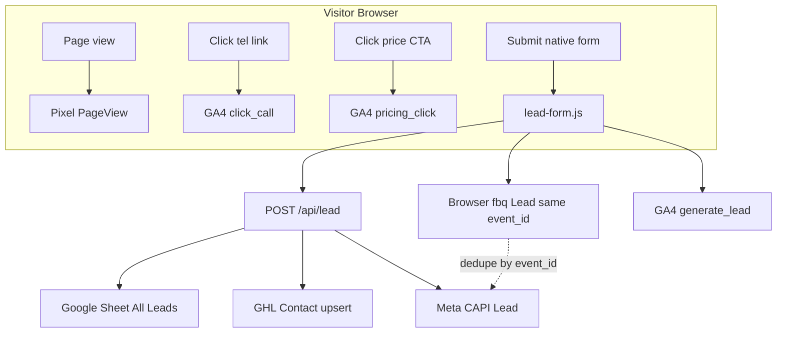

# Paradise Spas — Website Tracking, Leads & GHL SOP

> **Agency / multi-client version:** See [`AGENCY_TRACKING_AND_LEADS_SOP.md`](./AGENCY_TRACKING_AND_LEADS_SOP.md) — same stack, no inventory/fair assumptions. Use that to onboard new clients; use this doc for Paradise-specific IDs and tags.

**Site:** https://www.paradisespas.com  
**Repo:** `paradise-spas-website` (static HTML + Cloudflare Pages Functions)  
**Owner account (dashboard):** Increase ROAS Google  
**Last verified against codebase:** July 2026

Use this doc two ways:
1. **SOP** — human checklist for setup, QA, and troubleshooting.
2. **Master Cursor prompt** — paste Section 1 into a new AI chat when onboarding someone on this stack.

---

## SECTION 1 — MASTER CURSOR PROMPT (paste this block)

```
You are working on Paradise Spas (paradisespas.com) — a static HTML dealer site deployed on Cloudflare Pages with serverless lead capture.

## Architecture (do not guess — verify in repo)

HOSTING
- Cloudflare Pages project: paradise-spas
- Deploy production: npm run deploy (branch main)
- Deploy preview: npm run preview:deploy (branch preview → preview.paradisespas.com)
- Serverless API: functions/api/lead.js → POST /api/lead

LEAD PIPELINE (every native form)
Browser form (native-form.js renders, lead-form.js submits)
  → POST /api/lead (JSON)
  → validate.js (spam honeypot, email/phone, source-specific fields)
  → Google Sheet "All Leads" tab FIRST (required — forms fail without Sheets)
  → GHL Contacts API upsert (if GHL_API_TOKEN set)
  → Meta CAPI Lead event (if META_CAPI_ACCESS_TOKEN set)
  → Browser fires GA4 generate_lead + fbq Lead (same event_id as CAPI)

KEY IDS
- GA4: G-E5WGSEGZYP
- Clarity: xeoe7g20ml
- Meta Pixel: 1317738110513512
- Lead value: $950 USD
- GHL Location: NpZCArkZIoHhOIl8Qjd1
- Live Chat widget: 6a4454fd638eec5af4195a51

TRACKING FILES
- call-tracking.js → GA4 click_call, Clarity call_click, Meta Contact
- pricing-tracking.js → GA4 pricing_click, Clarity pricing_click
- lead-form.js → GA4 generate_lead, Meta Lead (browser), posts to /api/lead
- inventory-gate.js → GA4 fair_inventory_unlock | inventory_unlock
- thank-you.html → also fires generate_lead + Lead on page load (legacy — can double-count vs lead-form.js)

META DEDUPLICATION
- lead-form.js creates UUID meta_event_id before submit
- Same ID sent in POST body to /api/lead
- meta-capi.js sends server Lead with event_id = that UUID
- Browser fbq('track','Lead', {...}, { eventID: eventId })
- Meta dedupes browser + server when event_id matches → 1 conversion

GHL TAGGING (functions/lib/ghl.js tagsForSource)
- All API leads: website-form, lead-api
- fair-inventory-gate → fair-inventory-unlock
- minot-lead / inventory-gate → minot-lead, inventory-unlock
- fair-reserve → fair-reserve
- fair-soak-reserve → fair-soak-reserve (legacy nurture form — page now uses GHL calendar embed)
- pricing_modal / product_detail → pricing-request
- contact-page, financing-page, product-page, hot-tub-offer → matching tags

GHL CUSTOM FIELDS (API keys)
- fair_attendance, fair_visit_day, financing_interest, contact_message
- product_interested_in, product_category, estimated_retail_price, our_price, monthly_payment
- lead_source_page (full URL)

FORMS ARE NATIVE — NOT GHL IFRAMES
- native-form.js builds HTML forms into [data-native-form] containers
- lead-form.js binds [data-paradise-lead-form]
- No GHL Form Builder embeds on site (migrated bd4f1f9)

DASHBOARD (Looker Studio — 3 sources)
1. GA4 → click_call, pricing_click, generate_lead
2. Coupler.io GBP → listing call clicks
3. Google Sheet GHL sync → form_leads (Apps Script hourly)

When changing tracking or lead flow: update the matching .js file, Cloudflare env vars if needed, redeploy, then run QA checklist in PARADISE_SPAS_TRACKING_AND_LEADS_SOP.md Section 5.
```

---

## SECTION 2 — SYSTEM OVERVIEW (plain English)

Paradise Spas uses **four parallel measurement layers**:

| Layer | What it measures | Source of truth? |
|-------|------------------|------------------|
| **GA4** | Website behavior (calls, pricing clicks, form conversions) | Funnel trends |
| **Meta Pixel + CAPI** | Ad attribution & Lead conversions for Facebook/Instagram | Ad optimization |
| **Google Sheet Lead Vault** | Every form submission with GHL status | **Lead backup / audit** |
| **GHL CRM** | Contacts, tags, workflows, sales follow-up | **CRM / operations** |

**Rule of thumb:** Count **real leads** from GHL + Sheet. Use GA4 for funnel. Use Meta for ad ROAS.



---

## SECTION 3 — TRACKING SETUP (what's on every page)

### 3.1 Global tags (in `<head>` on most pages)

| Tool | ID | Purpose |
|------|-----|---------|
| **Google Analytics 4** | `G-E5WGSEGZYP` | Sessions, events, conversions |
| **Microsoft Clarity** | `xeoe7g20ml` | Session recordings, heatmaps |
| **Meta Pixel** | `1317738110513512` | PageView, Contact, Lead |

### 3.2 Site-wide scripts (before `</body>`)

| File | Events fired |
|------|----------------|
| `call-tracking.js` | `click_call` (GA4), `call_click` (Clarity), `Contact` (Meta) on any `tel:` link |
| `pricing-tracking.js` | `pricing_click` (GA4 + Clarity) on inventory cards, category CTAs, `?open=price` links |
| `ghl-modal.js` | Opens pricing modal; sets `data-lead-source` per button type |
| `native-form.js` | Renders forms into `[data-native-form]` shells |
| `lead-form.js` | Submits all `[data-paradise-lead-form]` to `/api/lead` |
| GHL Live Chat loader | Widget `6a4454fd638eec5af4195a51` |

### 3.3 GA4 conversion events (mark as conversions in GA4 Admin)

| Event | When it fires | Value |
|-------|---------------|-------|
| `click_call` | Phone link tap | — |
| `pricing_click` | Price / quote button click | — |
| `generate_lead` | Successful form submit (`lead-form.js`) | — |
| `inventory_unlock` | Minot inventory gate unlocked | — |
| `fair_inventory_unlock` | Fair inventory gate unlocked | — |

**Setup guide:** `dashboard/01-ga4-looker-base.md`  
**Looker layout:** `dashboard/04-looker-layout-share.md`

### 3.4 Meta events

| Event | When | Value |
|-------|------|-------|
| `PageView` | Every page load | — |
| `Contact` | Phone link tap | — |
| `Lead` | Form success (browser + server) | **$950** |

### 3.5 Clarity custom events

- `call_click` + `call_click_source`, `call_click_page`
- `pricing_click` + `pricing_click_source`, `pricing_click_page`
- `inventory_unlock` / `fair_inventory_unlock`

### 3.6 pricing_click source labels (for debugging in GA4)

`inventory_card`, `category_inventory`, `product_detail`, `homepage_slider`, `financing`, `coupon`, `primary_cta`, `secondary_cta`, `ghl_modal`, etc. — see `pricing-tracking.js` and `ghl-modal.js`.

---

## SECTION 4 — FORMS → GHL (complete flow)

### 4.1 How forms work (no GHL iframe)

1. HTML page has a container: `<div data-native-form data-lead-source="..." ...>`
2. `native-form.js` injects fields (name, email, phone, fair question, financing, etc.)
3. `lead-form.js` intercepts submit → `fetch('/api/lead', { method: 'POST', body: JSON })`
4. On success:
   - **unlock** → inventory gate opens (stays on page)
   - **thank-you** → redirect to `/thank-you.html`
   - **close-modal** → closes pricing modal, then thank-you

### 4.2 `/api/lead` server order (Cloudflare Function)

```
1. Validate payload (validate.js)
2. Verify Turnstile (if TURNSTILE_SECRET_KEY set)
3. Append row to Google Sheet "All Leads" (status PENDING)  ← REQUIRED
4. Upsert GHL contact (if GHL_API_TOKEN set)
5. Update Sheet row with GHL status (SENT / FAILED)
6. If GHL failed → "Missed Leads" tab + email alert (if configured)
7. Send Meta CAPI Lead (if token set) — does NOT block response
8. Return { ok: true, meta_event_id, ghl_ok, ghl_contact_id }
9. Browser fires Pixel + GA4 using returned meta_event_id
```

**Critical:** Google Sheets must be configured or **every form returns 503**.

### 4.3 Google Sheet structure ("All Leads" tab)

| Col | Field |
|-----|-------|
| A | submission_id |
| B | submitted_at |
| C | **source** (campaign identifier) |
| D | full_name |
| E | email |
| F | phone |
| G | fair_attendance OR financing_interest |
| H | **page_url** |
| I | ghl_status (PENDING → SENT/FAILED) |
| J | ghl_contact_id |
| K | ghl_error |

Also: **Missed Leads** tab for GHL failures.

### 4.4 Form sources by page (data-lead-source)

| Page / URL | Source code | GHL tags added |
|------------|-------------|----------------|
| `/inventory` gate | `minot-lead` | `minot-lead`, `inventory-unlock` |
| `/inventoryredrivervalleyfair/` gate | `fair-inventory-gate` | `fair-inventory-unlock` |
| `/redrivervalleyfair/` reserve | `fair-reserve` | `fair-reserve` |
| `/contact` | `contact-page` | `contact-page` |
| `/financing` | `financing-page` | `financing-page` |
| Pricing modals (most pages) | `pricing_modal` or `product_detail` | `pricing-request` |
| Fair inventory pricing modal | `minot-lead` on Minot page; `pricing_modal` on fair page unless `data-lead-campaign` set |
| `/hot-tub-offer/` | `hot-tub-offer` | base tags only |
| Product message forms | `product-page` | `product-page`, `pricing-request` |

**GHL contact Source field:** `Paradise Spas Website — {source}`

### 4.5 GHL custom fields written by API

| Field key | When populated |
|-----------|----------------|
| `fair_attendance` | Fair inventory gate (yes/maybe/no) |
| `fair_visit_day` | Fair soak reserve (legacy) |
| `financing_interest` | Minot gate + pricing modals |
| `contact_message` | Contact page |
| `product_interested_in` | Pricing modal with product |
| `product_category` | Pricing modal |
| `estimated_retail_price` | Pricing modal |
| `our_price` | Pricing modal |
| `monthly_payment` | Pricing modal |
| `lead_source_page` | Always (full URL) |

### 4.6 GHL workflow triggers (recommended)

| Campaign | Trigger tag |
|----------|-------------|
| Fair inventory unlock | `fair-inventory-unlock` |
| Minot inventory | `minot-lead` |
| Fair booth reservation | `fair-reserve` |
| Pricing requests | `pricing-request` |
| Contact page | `contact-page` |

**Note:** Meta Lead Ads (`metalead` tag) come from GHL's Meta integration — separate from website forms. A contact can have both `metalead` and `fair-inventory-unlock` if they came from a Meta ad and also submitted the website gate.

### 4.7 Pages WITHOUT lead forms

| Page | CTA instead |
|------|-------------|
| `/redrivervalleyavailableinventoryonly/` | **GHL calendar embed** (`BOOKING_URL` in `fair-nurture.js`) — book a booth time, no form |

### 4.8 Chat widget (separate channel)

- GHL Live Chat widget ID: `6a4454fd638eec5af4195a51`
- SMS/chat replies are **GHL Conversations** — not `/api/lead`
- Inventory page: 20s delay before chat loads; chat disabled when price button clicked
- **GHL setting:** Turn OFF "Enable contact form" in Live Chat widget (prevents spam SMS from unknown numbers)

---

## SECTION 5 — META PIXEL + CAPI DEDUPLICATION

### 5.1 Why both Pixel and CAPI?

- **Pixel (browser):** Fast, ties to `fbp`/`fbc` cookies, blocked by ad blockers / iOS.
- **CAPI (server):** Fires from Cloudflare when Sheet save succeeds — reliable backup.

### 5.2 How deduplication works (step by step)

```
1. User clicks Submit
2. lead-form.js: eventId = crypto.randomUUID()   // e.g. "a1b2c3d4-..."
3. POST /api/lead includes meta_event_id: eventId, fbp, fbc
4. Server saves lead → meta-capi.js POSTs to Meta Graph API:
     event_name: Lead
     event_id: eventId        ← SAME UUID
     em: sha256(email)
     ph: sha256(phone)
     client_ip_address, client_user_agent, fbp, fbc
5. API returns meta_event_id to browser
6. lead-form.js: fbq('track', 'Lead', { value: 950 }, { eventID: eventId })
7. Meta Events Manager sees Browser Lead + Server Lead with matching event_id
8. Meta counts ONE conversion
```

**Code locations:**
- Browser: `lead-form.js` (lines ~129, 147-149, 61-68, 171)
- Server: `functions/lib/meta-capi.js`, triggered from `functions/api/lead.js`

### 5.3 fbc (Facebook click ID) handling

If visitor arrived via `?fbclid=...`, `lead-form.js` builds `_fbc` cookie format: `fb.1.{timestamp}.{fbclid}` and sends to server. Improves ad attribution.

### 5.4 Cloudflare env vars for Meta

| Variable | Required | Value |
|----------|----------|-------|
| `META_CAPI_ACCESS_TOKEN` | Yes for CAPI | `EAA...` from Events Manager |
| `META_PIXEL_ID` | Optional | `1317738110513512` (default in code) |
| `META_TEST_EVENT_CODE` | Testing only | Remove after QA |

**Full guide:** `dashboard/META_CAPI_SETUP.md`

---

## SECTION 6 — CLOUDFLARE SECRETS CHECKLIST

Set in: **Cloudflare Dashboard → Pages → paradise-spas → Settings → Environment variables → Production**

### Required (forms work)

- [ ] `GOOGLE_SHEETS_ID`
- [ ] `GOOGLE_SERVICE_ACCOUNT_EMAIL`
- [ ] `GOOGLE_SERVICE_ACCOUNT_PRIVATE_KEY`

### Recommended

- [ ] `GHL_API_TOKEN` (`pit-...` Private Integration)
- [ ] `GHL_LOCATION_ID` (`NpZCArkZIoHhOIl8Qjd1`)
- [ ] `META_CAPI_ACCESS_TOKEN`
- [ ] `ALLOWED_ORIGIN` (`https://www.paradisespas.com`)

### Optional

- [ ] `TURNSTILE_SECRET_KEY` (+ site key on page `data-turnstile-site-key`)
- [ ] `ALERT_EMAIL` + `RESEND_API_KEY` (GHL failure alerts)
- [ ] `META_TEST_EVENT_CODE` (testing only)

Template: `dashboard/lead-api.env.example`

---

## SECTION 7 — LOOKER DASHBOARD (client-facing)

### 7.1 Three data sources

| Source | Data |
|--------|------|
| Paradise Spas — GA4 | Website events |
| Paradise Spas — GBP (Coupler) | Google listing call clicks |
| Paradise Spas — GHL (Sheet sync) | Form leads from CRM |

### 7.2 Five KPI scorecards

1. **Form leads** — GHL Sheet SUM `form_leads`
2. **Google listing calls** — GBP Coupler
3. **Call button taps** — GA4 `click_call`
4. **Pricing clicks** — GA4 `pricing_click`
5. **Thank-you / form conversions** — GA4 `generate_lead`

**Guides:** `dashboard/02-coupler-gbp.md`, `dashboard/03-ghl-sheets-sync.md`, `dashboard/04-looker-layout-share.md`

### 7.3 GHL → Sheet sync (separate from real-time API)

- Apps Script in `dashboard/ghl-lead-sync/Code.gs`
- Hourly pull of GHL contacts → `lead_log` + `daily_summary` tabs
- Used for Looker scorecards — may lag up to 1 hour behind live API

---

## SECTION 8 — QA CHECKLIST (run after any tracking or form change)

### 8.1 Pre-flight

- [ ] Cloudflare Production env vars present (Section 6)
- [ ] `npm run deploy` completed successfully
- [ ] GA4 Realtime open in one tab
- [ ] Meta Events Manager → Test events open (optional)

### 8.2 Phone tap test

- [ ] Tap phone on homepage
- [ ] GA4 Realtime shows `click_call`
- [ ] Clarity shows `call_click`

### 8.3 Pricing click test

- [ ] Click "Get Price" or inventory card CTA
- [ ] GA4 Realtime shows `pricing_click`

### 8.4 Form submit test (use test email)

- [ ] Submit fair inventory gate: `/inventoryredrivervalleyfair/`
- [ ] Inventory unlocks on page
- [ ] Google Sheet "All Leads" new row: `source=fair-inventory-gate`, `ghl_status=SENT`
- [ ] GHL contact created with tags `fair-inventory-unlock`, `website-form`, `lead-api`
- [ ] GHL custom field `lead_source_page` = full URL
- [ ] GA4 `generate_lead` fires
- [ ] Meta Test events: Browser Lead + Server Lead, **same Event ID**

### 8.5 Minot inventory test

- [ ] Submit `/inventory` gate with financing question
- [ ] GHL tags include `minot-lead`, `inventory-unlock`

### 8.6 GHL failure drill (optional)

- [ ] Temporarily break `GHL_API_TOKEN` on staging
- [ ] Form still saves to Sheet
- [ ] Row appears in "Missed Leads"
- [ ] Alert email received (if Resend configured)
- [ ] Visitor still sees success message

### 8.7 Double-count check

- [ ] Confirm Meta shows 1 Lead per submit (not 2) — event_id match
- [ ] Note: `thank-you.html` also fires `generate_lead` on load — inventory unlock flows may only fire from `lead-form.js` (no double on thank-you for unlock mode)

---

## SECTION 9 — TROUBLESHOOTING

| Symptom | Likely cause | Fix |
|---------|--------------|-----|
| Form says "Lead vault is not configured" | Missing Google Sheets env vars | Set Sheet trio in Cloudflare, redeploy |
| Form works but no GHL contact | `GHL_API_TOKEN` missing/invalid | Check token scope for location `NpZCArkZIoHhOIl8Qjd1` |
| GHL contact but no tags | Source code wrong on form | Check `data-lead-source` on form/container |
| Meta Pixel Lead only, no Server | `META_CAPI_ACCESS_TOKEN` missing | Set token, redeploy |
| Meta shows 2 Leads per submit | event_id mismatch | Verify `lead-form.js` + `meta-capi.js` both use same ID |
| GA4 generate_lead = 0 | Events not marked as conversions / not firing | Test Realtime; check form returns `{ ok: true }` |
| Looker form leads ≠ GHL | Sheet sync lag | GHL sync runs hourly; API is real-time |
| Fair leads tagged wrong | Wrong page URL in ad | Fair ads → `/inventoryredrivervalleyfair/`; Minot → `/inventory` |
| SMS spam from chat | GHL widget contact form ON | Disable in widget settings |

---

## SECTION 10 — DEPLOY & REPO REFERENCE

```bash
# Production
npm run deploy

# Preview (preview.paradisespas.com)
npm run preview:deploy

# Local static preview (no /api/lead)
npx serve . -l 3000
```

| Path | Purpose |
|------|---------|
| `functions/api/lead.js` | Lead API entry |
| `functions/lib/ghl.js` | GHL upsert + tags |
| `functions/lib/sheets.js` | Google Sheet vault |
| `functions/lib/meta-capi.js` | Meta server events |
| `functions/lib/validate.js` | Payload validation |
| `lead-form.js` | Browser form submit + tracking |
| `native-form.js` | Form HTML renderer |
| `call-tracking.js` | Phone click tracking |
| `pricing-tracking.js` | Price CTA tracking |
| `inventory-gate.js` | Gate unlock + unlock events |
| `ghl-modal.js` | Pricing modal |
| `dashboard/` | All setup guides |

---

## SECTION 11 — REPLICATE THIS STACK ON ANOTHER DEALER SITE

When cloning Paradise Spas architecture to another client:

1. [ ] Copy native form system (`native-form.js`, `lead-form.js`, `functions/`)
2. [ ] Create new GA4 property + replace `G-E5WGSEGZYP` in all HTML
3. [ ] Create new Clarity project + replace `xeoe7g20ml`
4. [ ] Create new Meta Pixel + update Pixel ID in HTML + `meta-capi.js` default
5. [ ] Generate new Meta CAPI token for that pixel
6. [ ] New GHL location ID + Private Integration token
7. [ ] New Google Sheet + service account shared to sheet
8. [ ] Set all Cloudflare env vars on new Pages project
9. [ ] Define `data-lead-source` codes + GHL tags per campaign
10. [ ] Create GHL custom fields matching `ghl.js` keys
11. [ ] Mark GA4 conversions + build Looker (3-source blend)
12. [ ] Run Section 8 QA checklist end-to-end
13. [ ] Document client-specific URLs, tags, and workflow triggers in their own copy of this SOP

---

## SECTION 12 — QUICK REFERENCE CARD

```
SITE:          www.paradisespas.com
GA4:           G-E5WGSEGZYP
PIXEL:         1317738110513512
CLARITY:       xeoe7g20ml
GHL LOCATION:  NpZCArkZIoHhOIl8Qjd1
LEAD API:      POST /api/lead
LEAD VALUE:    $950
DEDUPE KEY:    meta_event_id (UUID, shared Pixel + CAPI)

FAIR GATE:     fair-inventory-gate → fair-inventory-unlock
MINOT GATE:    minot-lead → minot-lead + inventory-unlock
FAIR RESERVE:  fair-reserve → fair-reserve

COUNT LEADS:   GHL contacts + Sheet "All Leads"
COUNT FUNNEL:  GA4 events
COUNT ADS:     Meta Events Manager (deduped Lead)
```
